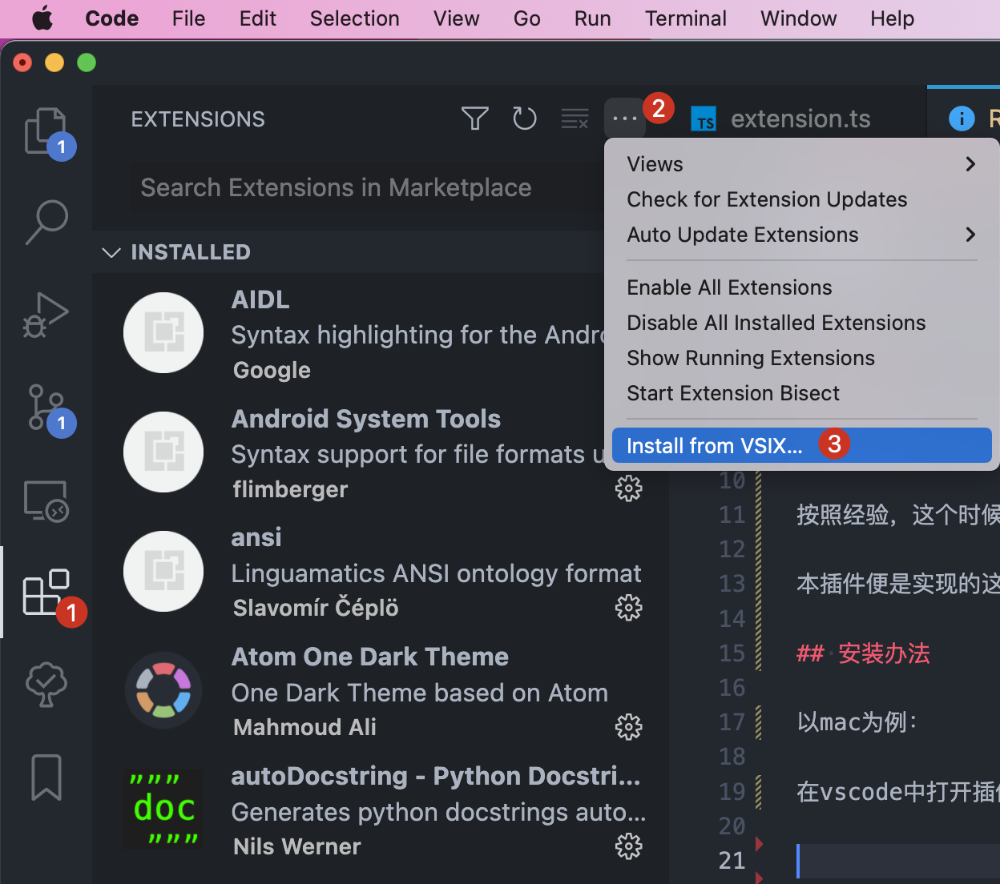
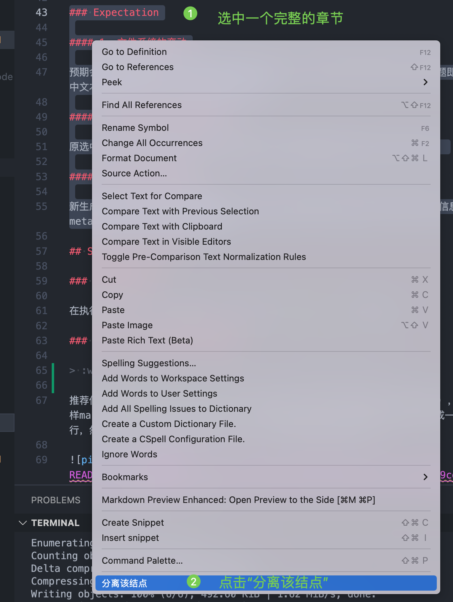
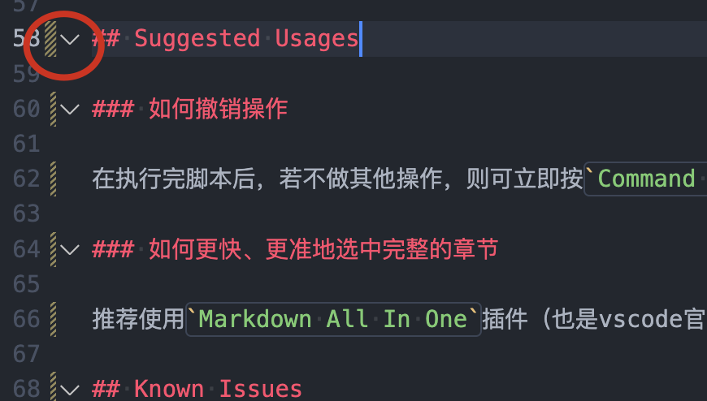

# markdown-nodes README

1. [Background](#background)
2. [Installation](#installation)
3. [Basic Usage](#basic-usage)
    1. [Steps](#steps)
    2. [Expectation](#expectation)
        1. [1. 文件系统的变动](#1-文件系统的变动)
        2. [2. 当前操作文件本身的变动](#2-当前操作文件本身的变动)
        3. [3. 新生成文件的内容](#3-新生成文件的内容)
4. [Suggested Usages](#suggested-usages)
    1. [如何撤销操作](#如何撤销操作)
    2. [如何更快、更准地选中完整的章节](#如何更快更准地选中完整的章节)
5. [TODO](#todo)
6. [Release Notes](#release-notes)
    1. [0.0.1](#001)
7. [Contact](#contact)

## Background

我们在写markdown文档时，经常碰到一个问题就是文档变得越来越庞大，标题层级越来越高，难以管理。

按照经验，这个时候最好的做法，是把某些正在focus的章节独立成一个新的markdown文件，并使用交叉索引与原文档链接起来。

本插件便是实现的这样的一个功能。

## Installation

在 vscode 中使用 “install from VSIX”选项：

  

然后选中本仓库的输出文件： “markdown-nodes-0.0.1.vsix” ，等待安装成功提示即可。

## Basic Usage

### Steps

1. 打开某个 md 文档
2. 选中某个完整的章节（比如 `###` 开头的某个章节）
3. 右键选中“分离该结点”

  

### Expectation

#### 1. 文件系统的变动

预期会在该文档的当前文件夹下生成一个新的文件，名字为选中的章节标题，章节标题即选中文本部分的第一个 `#` 开头的文本内容。

#### 2. 当前操作文件本身的变动

原选中文本的内容部分将会被一个超链接替代，超链接指向新生成的markdown文件。

#### 3. 新生成文件的内容

新生成的markdown文件的内容即原选中文本提升至最大级别后的结果，并附有meta信息，meta信息中的from键指向原文件。

## Suggested Usages

### 如何撤销操作

在执行完脚本后，若不做其他操作，则可立即按`Command + Z`撤销改动。

### 如何更快、更准地选中完整的章节

> :warning: 如果不选中一个完整的章节，则生成的结果可能不符合预期。

推荐使用`Markdown All In One`插件（也是vscode官方指定的markdown插件），这样markdown文档的每个标题前都有一个可点击的三角按钮：点击后即可折叠该章节成一行，然后选中该行至结尾（最好选至下行）即可自动选中该完整的章节。

 

## TODO

- [ ] 本插件适用的场景很依赖选中章节的正确性，而手动拉选难免会有误操作，比较合适的办法应该就正如点击那个小三角形一样，我们应该可以设置右键该三角形从而触发我们的操作，但该办法是否可行，还需要查询相关API

## Release Notes

### 0.0.1

Init

## Contact

wechat  : markshawn2020
mail    : shawninjuly@gmail.com